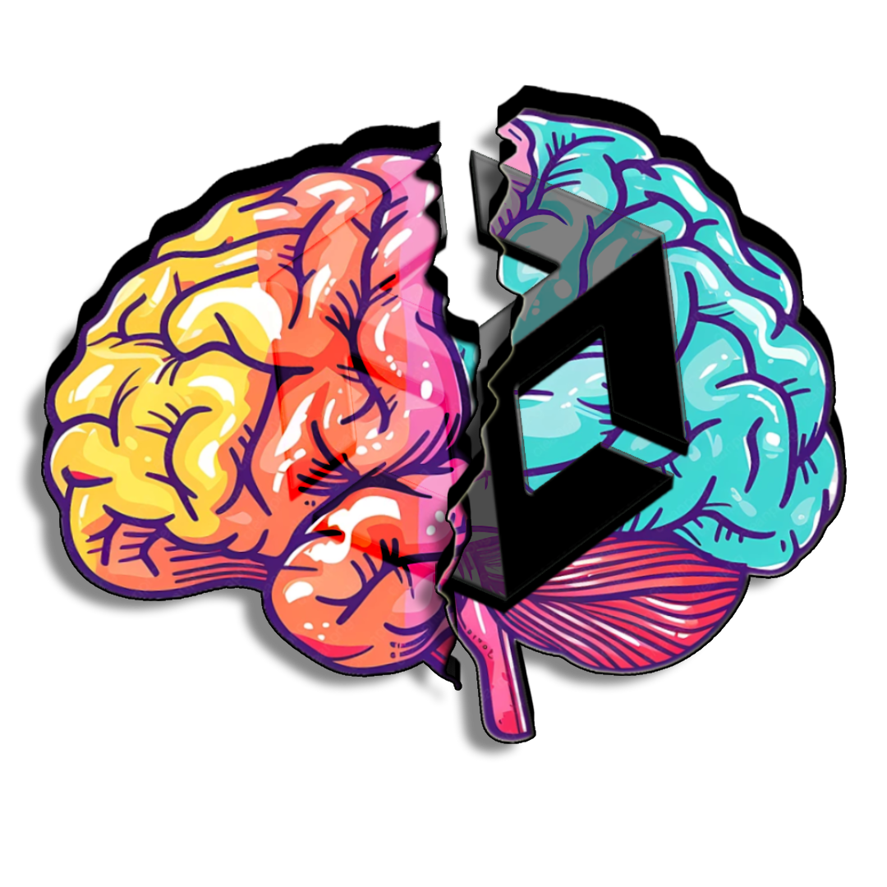

```mermaid
graph TB
    subgraph "UniBuddhi-AISDK Core"
        A[AISDKCore] --> B[AIProviderFactory]
        A --> C[AgentFactory]
        A --> D[TTSProviderFactory]
        A --> E[FunctionCallManager]
        
        B --> F[IAIProvider]
        C --> G[IAgent]
        D --> H[ITTSProvider]
        E --> I[IFunctionExtension]
    end
    
    subgraph "AI Providers"
        F --> J[OpenAI]
        F --> K[Anthropic]
        F --> L[Gemini]
        F --> M[Cohere]
        F --> N[DeepSeek]
    end
    
    subgraph "Agent Types"
        G --> O[Assistant]
        G --> P[Creative]
        G --> Q[Technical]
        G --> R[Analytical]
        G --> S[Conversational]
    end
    
    subgraph "TTS Providers"
        H --> T[ElevenLabs]
        H --> U[Azure Speech]
        H --> V[Google TTS]
        H --> W[Amazon Polly]
        H --> X[OpenAI TTS]
    end
    
    subgraph "Extensions"
        I --> Y[Calculator]
        I --> Z[Weather]
        I --> AA[Knowledge Search]
        I --> BB[Time & Date]
        I --> CC[Personality]
    end
    
    style A fill:#4CAF50,stroke:#388E3C,color:#fff
    style B fill:#2196F3,stroke:#1976D2,color:#fff
    style C fill:#2196F3,stroke:#1976D2,color:#fff
    style D fill:#2196F3,stroke:#1976D2,color:#fff
    style E fill:#FF9800,stroke:#F57C00,color:#fff
```

# 🧠 UniBuddhi-AISDK

<div align="center">



**A Comprehensive Unity AI Software Development Kit**

*Integrate Multiple AI Providers, Create Intelligent Agents, and Add Voice Capabilities to Your Unity Projects*

[](https://unity.com/)
[](https://docs.microsoft.com/en-us/dotnet/csharp/)
[](LICENSE)
[](CONTRIBUTING.md)

</div>

---

## 📋 Table of Contents

- [🌟 Features](#-features)
- [🏗️ Architecture](#️-architecture)
- [🚀 Quick Start](#-quick-start)
- [💡 Usage Examples](#-usage-examples)
- [🔧 Configuration](#-configuration)
- [🤖 AI Providers](#-ai-providers)
- [🎭 Agent Types](#-agent-types)
- [🔌 Extensions System](#-extensions-system)
- [🗣️ Text-to-Speech](#️-text-to-speech)
- [⚙️ Function Calling](#️-function-calling)
- [📚 Examples](#-examples)
- [🤝 Contributing](#-contributing)
- [📄 License](#-license)

---

## 🌟 Features

### 🎯 **Core Capabilities**
- **🔄 Multi-Provider Support** - Seamlessly switch between OpenAI, Anthropic, Google Gemini, Cohere, and DeepSeek
- **🤖 Intelligent Agents** - Pre-built agent types with specialized behaviors and personalities
- **🔌 Extension System** - Modular plugin architecture for custom functionality
- **🗣️ Voice Integration** - Multiple TTS providers (ElevenLabs, Azure, Google, Amazon, OpenAI)
- **⚡ Function Calling** - Let AI agents execute real-world functions and operations
- **🎭 Personality System** - Create agents with unique personalities and behaviors
- **🔧 Unity Integration** - Built specifically for Unity with coroutine-based async operations

### 🛠️ **Technical Features**
- **Interface-Driven Design** - Clean abstractions for easy extensibility
- **Factory Pattern** - Streamlined object creation and configuration
- **Event System** - Comprehensive event broadcasting for loose coupling
- **Singleton Management** - Centralized SDK management with lifecycle control
- **Error Handling** - Robust error management with detailed logging
- **Performance Monitoring** - Built-in performance tracking and optimization

---

## 🏗️ Architecture



---

## 🚀 Quick Start

### 📦 Installation

1. **Clone or Download** the repository to your Unity project
2. **Import** the `Assets/Scripts/AISDK` folder into your Unity project
3. **Add** the `AISDKCore` component to a GameObject in your scene
4. **Configure** your AI provider API keys in the inspector

### ⚡ Basic Setup

```csharp
using UniBuddhi.Core;
using UniBuddhi.Core.Models;

public class MyAIController : MonoBehaviour
{
    void Start()
    {
        // Initialize the SDK
        AISDKCore.Instance.SetProvider(AIProviderType.OpenAI);
        AISDKCore.Instance.SetApiKey("your-api-key-here");
        
        // Subscribe to events
        AISDKCore.OnAIResponse += HandleAIResponse;
        AISDKCore.OnError += HandleError;
    }
    
    public void SendMessage()
    {
        StartCoroutine(AISDKCore.Instance.SendMessageAsync(
            "Hello, AI assistant!", 
            AgentType.Assistant
        ));
    }
    
    private void HandleAIResponse(string response)
    {
        Debug.Log($"AI Response: {response}");
    }
    
    private void HandleError(string error)
    {
        Debug.LogError($"AI Error: {error}");
    }
}
```

---

## 💡 Usage Examples

### 🎭 Creating Custom Agents with Personalities

```csharp
// Create a wizard character with personality
var wizardPersonality = new AgentPersonality("Wise Wizard") 
{
    SystemPrompt = "You are an ancient wizard with vast knowledge of magic and lore. Speak in an mystical, wise manner.",
    Temperature = 0.8f,
    Traits = new Dictionary<string, float>
    {
        { "wisdom", 0.9f },
        { "mystical", 0.8f },
        { "helpful", 0.7f }
    }
};

var wizard = AISDKCore.Instance.CreateAgent(
    "wizard", 
    AgentType.Creative, 
    wizardPersonality,
    new string[] { "PersonalityExtension", "CurrentTimeExtension" }
);
```

### ⚙️ Function Calling Example

```csharp
// Enable function calling with calculator extension
AISDKCore.Instance.EnableFunctionCalling(true);

// Send a math question
StartCoroutine(AISDKCore.Instance.SendMessageWithFunctionsAsync(
    "What's the square root of 144 plus 25?",
    "calculator-agent"
));

// The AI will automatically call the calculator functions!
```

### 🗣️ Voice-Enabled Conversations

```csharp
// Enable TTS for voice responses
AISDKCore.Instance.EnableTTS(TTSProviderType.ElevenLabs, "your-elevenlabs-key");
AISDKCore.Instance.SetVoiceId("your-voice-id");

// Send message with automatic speech generation
AISDKCore.Instance.SendMessage("Tell me a story", AgentType.Creative, true);

// Listen for speech events
AISDKCore.OnSpeechStarted += () => Debug.Log("AI started speaking");
AISDKCore.OnSpeechFinished += () => Debug.Log("AI finished speaking");
```

---

## 🔧 Configuration

### 🎛️ Inspector Settings

The `AISDKCore` component provides extensive configuration options in the Unity Inspector:

| Setting | Description | Default |
|---------|-------------|----------|
| **Selected Provider** | Choose your AI provider | Gemini |
| **API Key** | Your provider's API key | - |
| **Default Agent Type** | Default agent behavior | Assistant |
| **Enable Extensions** | Activate extension system | True |
| **Enable TTS** | Text-to-speech functionality | True |
| **Enable Function Calling** | Allow AI to call functions | True |
| **Debug Logs** | Show detailed logging | True |

### 🔑 Environment Variables

For security, you can also use environment variables:

```csharp
// Set API keys via environment variables
Environment.SetEnvironmentVariable("OPENAI_API_KEY", "your-key");
Environment.SetEnvironmentVariable("ELEVENLABS_API_KEY", "your-key");
```

---

## 🤖 AI Providers

| Provider | Status | Features |
|----------|--------|-----------|
| **🤖 OpenAI** | ✅ Full Support | GPT-4, GPT-3.5, Function Calling |
| **🧠 Anthropic** | ✅ Full Support | Claude 3, Claude 2 |
| **💎 Google Gemini** | ✅ Full Support | Gemini Pro, Gemini Vision |
| **🌊 Cohere** | ⚠️ Basic Support | Command Models |
| **🔍 DeepSeek** | ⚠️ Basic Support | DeepSeek Coder |

### 🔄 Switching Providers

```csharp
// Runtime provider switching
AISDKCore.Instance.SetProvider(AIProviderType.OpenAI);
AISDKCore.Instance.SetApiKey("new-api-key");

// Test connection
StartCoroutine(AISDKCore.Instance.TestProviderConnection((success, message) => {
    Debug.Log($"Connection: {(success ? "✅ Success" : "❌ Failed")} - {message}");
}));
```

---

## 🎭 Agent Types

| Agent Type | Personality | Best For |
|------------|-------------|----------|
| **🤝 Assistant** | Helpful, balanced | General assistance, Q&A |
| **🎨 Creative** | Imaginative, expressive | Storytelling, creative writing |
| **🔧 Technical** | Precise, analytical | Code help, technical docs |
| **📊 Analytical** | Data-driven, logical | Analysis, problem-solving |
| **💬 Conversational** | Friendly, engaging | Chat, social interaction |

### 🛠️ Custom Agent Creation

```csharp
// Create a specialized game master agent
var gmPersonality = new AgentPersonality("Game Master") 
{
    SystemPrompt = "You are a creative dungeon master for a fantasy RPG.",
    Temperature = 0.9f,
    MaxTokens = 2000
};

var gameMaster = AISDKCore.Instance.CreateAgent(
    "gm", 
    AgentType.Creative, 
    gmPersonality,
    new string[] { "PersonalityExtension", "WeatherExtension" }
);
```

---

## 🔌 Extensions System

### 📦 Built-in Extensions

| Extension | Purpose | Functions |
|-----------|---------|----------|
| **🧮 Calculator** | Math operations | add, subtract, multiply, divide, sqrt, power |
| **🌤️ Weather** | Weather information | get_current_weather, get_forecast |
| **🔍 Knowledge Search** | Information retrieval | search_knowledge, get_definition |
| **⏰ Current Time** | Date/time context | get_current_time, get_timezone |
| **🎭 Personality** | Behavior modification | Dynamic personality traits |

### 🛠️ Creating Custom Extensions

```csharp
public class CustomGameExtension : BaseFunctionExtension
{
    public override string ExtensionName => "GameExtension";
    public override string Description => "Game-specific functions";
    
    [FunctionCall("roll_dice", "Roll dice with specified number of sides")]
    public FunctionResult RollDice(int sides = 6, int count = 1)
    {
        var results = new List<int>();
        for (int i = 0; i < count; i++)
        {
            results.Add(UnityEngine.Random.Range(1, sides + 1));
        }
        
        return new FunctionResult(true, $"Rolled {count}d{sides}: {string.Join(", ", results)}");
    }
}
```

---

## 🗣️ Text-to-Speech

### 🎵 Supported TTS Providers

| Provider | Quality | Features | Status |
|----------|---------|----------|--------|
| **🎤 ElevenLabs** | ⭐⭐⭐⭐⭐ | Neural voices, emotions | ✅ Complete |
| **🔵 Azure Speech** | ⭐⭐⭐⭐ | SSML, voice styles | 🚧 Template |
| **🟢 Google TTS** | ⭐⭐⭐ | WaveNet voices | 🚧 Template |
| **🟠 Amazon Polly** | ⭐⭐⭐ | Neural voices | 🚧 Template |
| **🤖 OpenAI TTS** | ⭐⭐⭐⭐ | High-quality voices | 🚧 Template |

### 🎛️ Voice Configuration

```csharp
// Configure ElevenLabs TTS
var ttsConfig = new TTSConfiguration
{
    Provider = TTSProviderType.ElevenLabs,
    ApiKey = "your-elevenlabs-key",
    VoiceId = "voice-id",
    VoiceSettings = new VoiceSettings
    {
        Stability = 0.5f,
        SimilarityBoost = 0.8f,
        Style = 0.2f
    }
};

AISDKCore.Instance.ConfigureTTS(ttsConfig);
```

---

## ⚙️ Function Calling

Enable AI agents to execute real-world functions and operations.

### 🔧 Basic Function Calling

```csharp
// Enable function calling
AISDKCore.Instance.EnableFunctionCalling(true);

// Register function extensions
AISDKCore.Instance.RegisterFunctionExtension(new CalculatorExtension());
AISDKCore.Instance.RegisterFunctionExtension(new WeatherInfoExtension());

// AI can now call these functions automatically!
StartCoroutine(AISDKCore.Instance.SendMessageWithFunctionsAsync(
    "What's the weather like and what's 15 * 24?",
    "enhanced-agent"
));
```

### 📊 Function Call Monitoring

```csharp
// Monitor function calls
AISDKCore.OnFunctionCalled += (functionName, parameters, result) => {
    Debug.Log($"Function '{functionName}' called with {parameters} -> {result}");
};
```

---

## 📚 Examples

### 📁 Example Scripts

| Example | Description | File |
|---------|-------------|------|
| **🚀 Quick Start** | Basic AI integration | `QuickStartFunctionExample.cs` |
| **🎯 Complete AI** | Full-featured implementation | `CompleteAIExample.cs` |
| **🤖 Enhanced Agents** | Advanced agent features | `EnhancedAgentExample.cs` |
| **⚙️ Function Calling** | Function execution examples | `EnhancedAgentFunctionExample.cs` |
| **🎭 Personality System** | Custom personalities | `PersonalityExampleUsage.cs` |
| **🎛️ Manager UI** | Visual management interface | `PersonalityManagerUI.cs` |

### 🎮 Game Integration Examples

```csharp
// Game NPC with AI personality
public class AICharacter : MonoBehaviour
{
    [SerializeField] private string characterName;
    [SerializeField] private AgentPersonality personality;
    
    void Start()
    {
        // Create character-specific AI agent
        var agent = AISDKCore.Instance.CreateAgent(
            characterName,
            AgentType.Conversational,
            personality,
            new string[] { "PersonalityExtension", "CurrentTimeExtension" }
        );
    }
    
    public void TalkToPlayer(string playerMessage)
    {
        StartCoroutine(AISDKCore.Instance.SendMessageAsync(
            playerMessage, 
            characterName,
            true // Enable voice response
        ));
    }
}
```

---

## 🎯 Use Cases

### 🎮 Game Development
- **🤖 Intelligent NPCs** - Create characters with unique personalities
- **📖 Dynamic Storytelling** - Generate adaptive narratives
- **🎲 Game Master AI** - Automate tabletop RPG sessions
- **💬 Player Assistance** - Provide contextual help and guidance

### 🏢 Applications
- **🎓 Educational Tools** - AI tutors and learning assistants
- **🗣️ Voice Interfaces** - Conversational UI systems
- **🔧 Technical Support** - Automated help systems
- **🎨 Creative Tools** - AI-powered content generation

---

## 🤝 Contributing

We welcome contributions! Here's how you can help:

### 🐛 Reporting Issues
- Use the GitHub issue tracker
- Provide detailed reproduction steps
- Include Unity version and system info

### 💻 Code Contributions
1. Fork the repository
2. Create a feature branch
3. Follow the coding standards
4. Add tests for new features
5. Submit a pull request

### 📝 Documentation
- Improve existing documentation
- Add usage examples
- Create tutorials

---

## 📄 License

This project is licensed under the MIT License - see the [LICENSE](LICENSE) file for details.

---

## 🙋 Support

- **📖 Documentation**: Check the `/Examples` folder for detailed guides
- **💬 Community**: Join our discussions in GitHub Issues
- **🐛 Bug Reports**: Use the GitHub issue tracker
- **💡 Feature Requests**: Open an issue with the enhancement label

---

<div align="center">

**Made with ❤️ for the Unity Community**

*If this project helped you, please consider giving it a ⭐!*

</div>
